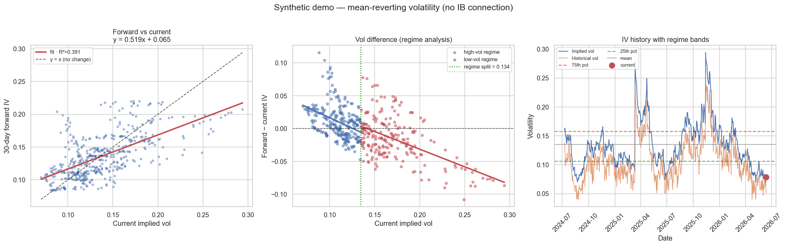

# 📈 Volatility Analytics Platform

A Streamlit dashboard for studying the **implied** and **historical volatility** of any stock, using live data from Interactive Brokers. It classifies the current volatility regime, measures how strongly volatility mean-reverts, and tracks the volatility risk premium — the structural edge behind most options-selling strategies.

It's also a teaching tool. The [Volatility, explained](#volatility-explained) section below is a self-contained primer on the concepts the dashboard measures, written for someone who has never traded an option.



---

## Contents

- [Quick start](#quick-start)
- [Quant for babies](#quant-for-babies) — the whole idea in plain words
- [Volatility, explained](#volatility-explained) — the concepts
  - [1. What volatility is](#1-what-volatility-is)
  - [2. Two kinds: implied vs. historical](#2-two-kinds-implied-vs-historical)
  - [3. The volatility risk premium](#3-the-volatility-risk-premium)
  - [4. Mean reversion](#4-mean-reversion)
  - [5. Volatility regimes](#5-volatility-regimes)
- [How the dashboard measures all this](#how-the-dashboard-measures-all-this) — the methodology
- [Reading the output](#reading-the-output)
- [Installation](#installation)
- [Project structure](#project-structure)
- [Notes & caveats](#notes--caveats)

---

## Quick start

**See it work with no setup** (synthetic data, generates a PNG):

```bash
pip install -r requirements.txt
python demo_plot.py
```

**Run the live dashboard** (requires TWS or IB Gateway running with the API enabled):

```bash
streamlit run iv_dashboard.py
```

Then in the sidebar: connect to IB → enter a symbol (`SPY`) and duration (`2 Y`) → pick your series → **Query data**.

---

## Quant for babies

No math, no jargon. Just the idea.

🎢 **Volatility = how bumpy the ride is.** Some stocks sit still like a parked car. Others bounce around like a kid on a trampoline. Volatility is a number for how much something jumps around — and it doesn't care *which way*, only *how much*.

🔮 **There are two bumpiness numbers, and they're different.**
- One says how bumpy it *was* yesterday. (We can just look. No arguing.) → **historical vol**
- One says how bumpy people *think* it'll be tomorrow. (A guess, baked into prices.) → **implied vol**

Think of weather: historical vol is *"it rained 3 days last week."* Implied vol is *"the forecast says 80% chance of rain."* One is what happened; one is what people expect.

💸 **People overpay for the scary forecast.** Just like you buy umbrella insurance even on sunny days, investors pay extra to protect against a market storm. So the "forecast" number (implied) is usually a little *higher* than the rain that actually falls (historical). That little gap is free-ish money for the person *selling* the umbrellas — most of the time. The catch: every once in a while there's a real hurricane, and the umbrella-seller pays big. That's the deal. This gap is the **volatility risk premium.**

🧲 **Bumpiness snaps back to normal.** When a stock goes crazy-jumpy, it almost always calms down soon after. When it gets sleepy-quiet, it eventually wakes up. It's like a stretched rubber band pinging back to the middle. So if bumpiness is *way* high right now, the smart bet is "it'll probably come down." This is **mean reversion**, and it's the whole reason this dashboard exists.

🌤️ **There are calm seasons and stormy seasons.** In calm times, things stay calm for ages. In stormy times, panics flare up and die down fast. The same rubber band snaps back *harder* during storms. So we measure the calm and stormy periods separately instead of mushing them together. These are **regimes.**

**That's it.** The dashboard just measures: *how bumpy are we right now (vs. usual)?*, *how fast will it snap back?*, and *how big is the umbrella-seller's gap?* Everything below is the same five ideas with the actual numbers attached.

---

## Volatility, explained

> New to this? Read straight through — each part builds on the last. Already fluent? Skip to [the methodology](#how-the-dashboard-measures-all-this).

### 1. What volatility is

**Volatility is the size of a stock's typical move, ignoring direction.** Formally it's the standard deviation of returns, quoted on an annual basis.

If a stock has **20% annualized volatility**, then in a normal year it should land within ±20% of where it started about two-thirds of the time (one standard deviation). A 60%-vol stock is three times as jumpy; a 10%-vol utility barely budges.

Two things to internalize up front:

- **Volatility is about magnitude, not direction.** A stock that reliably rips +5% a day is *more* volatile than one that drifts quietly upward — even though the second one is the better investment. Vol spikes in crashes *and* in melt-ups.
- **Volatility is quoted annualized.** A daily move of ~1.25% corresponds to roughly 20% annualized (because moves scale with the square root of time: 1.25% × √252 ≈ 20%). This √252 scaling matters later — see [Notes & caveats](#notes--caveats).

### 2. Two kinds: implied vs. historical

This is the single most important distinction in the whole project. There are two ways to measure volatility, and **the gap between them is the entire opportunity.**

| | **Historical (realized) vol — HV** | **Implied vol — IV** |
|---|---|---|
| Question it answers | How much *did* the stock move? | How much does the market *expect* it to move? |
| Direction in time | Backward-looking | Forward-looking |
| Source | Computed from past price returns | Backed out of option prices |
| Nature | A matter of record | A matter of opinion |

**Historical vol** is just arithmetic on past prices — there's nothing to argue about.

**Implied vol** is subtler. An option is a bet on movement, so the more movement the market expects, the more an option is worth. Run that logic backward: take the *price* people are actually paying for an option, plug it into an option-pricing model (Black–Scholes), and solve for the volatility number that justifies that price. That number is the implied volatility — **the market's consensus forecast of future realized volatility, expressed as a single number.**

> **The mental model:** IV is the *forecast*. HV is the *result*. Everything else in this dashboard comes from comparing a forecast to what actually happened.

### 3. The volatility risk premium

Here's the punchline that makes vol tradeable: **on average, implied vol is higher than the realized vol that follows it.** The market habitually *over*-forecasts how much stocks will move. That persistent overpricing is the **volatility risk premium (VRP)**.

Why would a forecast be biased high, year after year, without arbitrageurs erasing it? Because **options are insurance, and insurance is always sold at a markup.**

- Most option buyers are *hedgers* — funds buying puts to protect against a crash. Like homeowners buying fire insurance, they knowingly overpay for peace of mind. They don't expect disaster; they pay the premium anyway.
- The sellers on the other side collect that premium. In exchange, they eat the rare, brutal loss when a crash actually arrives.

So the VRP isn't a free lunch — it's **compensation for bearing tail risk.** It's the reason covered calls, cash-secured puts, and short straddles carry a positive expected return: they're harvesting insurance premium. And it's why the occasional volatility spike is so painful for sellers — that's the insurance claim coming due.

What the sign tells you:

- **IV − HV > 0** (the normal state): options are richly priced relative to what unfolds → the edge favors **selling** volatility.
- **IV − HV < 0** (rare, mid-crisis): reality is moving faster than options priced in → the edge favors **buying** volatility, and it's a sign the market is behind the curve on risk.

### 4. Mean reversion

Stock *prices* are roughly a random walk — knowing a stock rose yesterday tells you almost nothing about tomorrow. **Volatility is the opposite: it is strongly mean-reverting.** It gets pulled back toward a long-run average like a stretched spring.

- A shock — bad earnings, a Fed surprise, a crash — sends vol **spiking**. Then, as the panic drains out, it **decays** back toward normal.
- A long, sleepy bull market lets vol **grind down to lows**. Then something eventually jolts it back up.

This is why the question *"is vol high or low **relative to its own history**?"* is tradeable in a way that "is the price high or low?" is not. If volatility is in the 95th percentile of its own past year, the base rate overwhelmingly favors it falling rather than climbing further. The dashboard pins this down two ways: a **percentile rank** (where are we right now?) and a **forward regression** (how hard does vol revert from here?).

### 5. Volatility regimes

One last refinement: vol doesn't always revert to the same level at the same speed. Markets cluster into **regimes**.

- **Low-vol regimes** (e.g. 2017): calm can persist for a very long time. Vol grinds sideways at lows and reverts only weakly.
- **High-vol regimes** (e.g. 2008, March 2020): turbulent, and reversion is fast and violent — spikes collapse almost as quickly as they appear.

Because the two behave so differently, averaging them together is misleading. The dashboard finds the boundary between regimes statistically and then measures reversion **separately on each side**, so a fast-reverting crisis doesn't get blended with a years-long calm into one meaningless number.

---

## How the dashboard measures all this

Each concept above maps onto a concrete computation in [`iv_dashboard.py`](iv_dashboard.py).

### Percentile rank → regime label

A **rolling 252-day percentile rank** (252 ≈ trading days in a year) places today's vol against its own trailing-year history. If today exceeds 95% of the last year's readings, the rank is `0.95`. That single number drives the headline regime label and the mean-reversion signal:

| Percentile | Regime label | Mean-reversion signal |
|---|---|---|
| > 80% | **HIGH VOLATILITY** | expect reversion **down** |
| 60–80% | Above average | neutral |
| 40–60% | Normal | neutral |
| 20–40% | Below average | neutral |
| < 20% | **LOW VOLATILITY** | expect reversion **up** |

The edges flag the directions where reversion is most likely, because extreme percentiles are the least sustainable.

### Forward regression → is vol reverting, and how hard?

The direct test of mean reversion ([§4](#4-mean-reversion)). For every day, compute the **average vol over the *next* 30 days** and regress it on **today's** vol:

```
forward_vol = slope × current_vol + intercept
```

The **slope** is the headline:

| Slope | Interpretation |
|---|---|
| **< 1** | **Mean reversion** — extra vol today fades over the coming month. The normal, expected result. |
| **≈ 1** | Random walk — today's vol is the best guess for tomorrow's; no reversion. |
| **> 1** | Momentum — vol feeds on itself. Unusual; seen when a regime is breaking. |

The **fixed point** — where the fitted line crosses `y = x`, i.e. `intercept / (1 − slope)` — is the vol level that predicts *no change*. It's the implied long-run equilibrium: above it vol tends to fall back, below it vol tends to climb toward it. The code uses this point as the regime boundary.

### Regime split → reversion strength on each side

To capture the calm-vs-turbulent asymmetry ([§5](#5-volatility-regimes)), observations are split at the fixed point into **high-vol** and **low-vol** groups, and each gets its own regression on the **change** in vol (`forward − current`):

- A **negative slope** means high current vol predicts a *drop* — and the steeper it is, the faster and stronger the reversion.
- Comparing the two slopes exposes the asymmetry: the high-vol regime almost always reverts harder (spikes snap back) than the low-vol regime (calm lingers).

Each fit reports **slope, intercept, R²** (how much variation it explains), **p-value** (significance), and **sample size** — all downloadable as CSV.

### IV − HV spread → the risk premium over time

With both series loaded, the dashboard plots the **IV − HV spread** through time against its historical mean ([§3](#3-the-volatility-risk-premium)). Persistently positive readings are the premium accruing to vol sellers. Watch for it compressing toward zero or going negative — that's the market repricing risk faster than realized vol has caught up.

---

## Reading the output

The demo image (and the live dashboard's main panel) shows three charts left to right:

1. **Forward vs. current** — each dot is one day: x = today's vol, y = vol over the next 30 days. The red line is the fit; the dashed `y = x` line is "no change." A fit *flatter* than `y = x` is mean reversion in action.
2. **Regime split** — the change in vol (`forward − current`) vs. current vol, colored by regime, with the green line marking the fixed-point boundary. Downward-sloping clouds = reversion.
3. **Vol history with bands** — the raw vol series over time with its mean and 25th/75th-percentile bands, current value highlighted. This is the "where are we now" view.

In the live app you also get the metrics row (current vol, percentile, regime label, reversion signal), the IV−HV spread chart, and the full regression table.

---

## Installation

**Requirements**

- Python 3.9+
- For live data: a running **TWS** or **IB Gateway** with the API enabled (default paper-trading port `7497`)

**Dependencies**

```bash
pip install -r requirements.txt
```

> **About `ibapi`:** the PyPI package (`ibapi>=9.81`) is fine for historical IV/HV requests. For IB's current 10.x client, install from the TWS API download instead:
> ```bash
> cd "C:\TWS API\source\pythonclient" && pip install .
> ```

The offline demo (`demo_plot.py`) needs none of the IB setup — it runs on synthetic data and is the fastest way to confirm the analysis pipeline works.

---

## Project structure

```
iv_dashboard.py               # Streamlit app: IB client, analysis functions, UI
demo_plot.py                  # Offline demo on synthetic mean-reverting vol → PNG
demo_volatility_analysis.png  # Example output of demo_plot.py
requirements.txt              # Python dependencies
```

The analysis functions in `iv_dashboard.py` (`build_vol_series`, `rolling_percentile`, `analyze`, …) are pure and IB-free — `demo_plot.py` imports `analyze` directly, which is why the demo exercises the exact same pipeline as the live app.

---

## Notes & caveats

**Annualization.** IB's `OPTION_IMPLIED_VOLATILITY` and `HISTORICAL_VOLATILITY` series are *already annualized* decimals (`0.18` = 18%). The sidebar's **√252 toggle is off by default and should stay off** — turning it on re-applies an annualization factor that's already baked in, double-counting it into nonsensical 300%+ readings. It exists only to reproduce a legacy bug for comparison.

**This is an analysis tool, not trading advice.** Everything here describes statistical tendencies and historical base rates. Mean reversion is reliable until the regime breaks; the volatility risk premium is positive until the crash that wipes out a year of it. Size accordingly.
